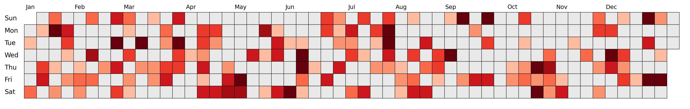
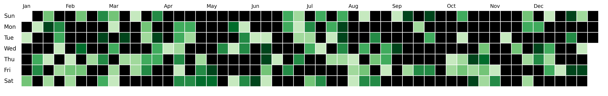
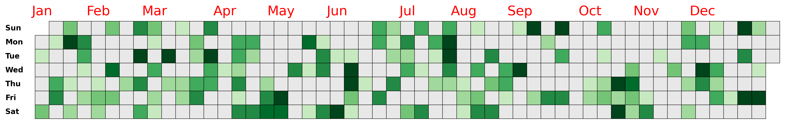
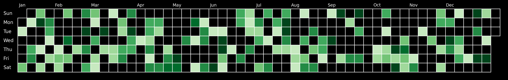

# dayplot

## Quick start

```py
import dayplot as dplot

df = dplot.load_sample()  # requires pandas to be installed

fig, ax = dplot.github_chart(
    dates=df["date"],
    values=df["values"],
    start_date="2024-01-01",
    end_date="2024-12-31"
)
```


<br><br>

## Customization

- Change colormap

```py
import dayplot as dplot

df = dplot.load_sample()

fig, ax = dplot.github_chart(
    df["date"],
    df["values"],
    cmap="Reds", # any matplotlib colormap
    start_date="2024-01-01",
    end_date="2024-12-31",
)
```



- Change other colors

```py
import dayplot as dplot

df = dplot.load_sample()

fig, ax = dplot.github_chart(
    df["date"],
    df["values"],
    start_date="2024-01-01",
    end_date="2024-12-31",
    edgecolor="white",      # any matplotlib color
    color_for_none="black", # any matplotlib color
    edgewidth=1,
)
```



- Text styling

```py
import dayplot as dplot

df = dplot.load_sample()

fig, ax = dplot.github_chart(
    df["date"],
    df["values"],
    start_date="2024-01-01",
    end_date="2024-12-31",
    day_kws={"weight": "bold"},              # args passed to ax.text()
    month_kws={"size": 18, "color": "red"},  # args passed to ax.text()
    day_x_margin=0.03, # shift day labels to the left (default = 0.02)
    month_y_margin=0.7, # shift month labels to the top (default = 0.4)
)
```



- Dark theme

```py
import dayplot as dplot

df = dplot.load_sample()

fig, ax = dplot.github_chart(
    df["date"],
    df["values"],
    start_date="2024-01-01",
    end_date="2024-12-31",
    color_for_none="black",
    edgecolor="white",
    edgewidth=1,
    day_kws={"color": "white"},
    month_kws={"color": "white"},
)
fig.set_facecolor("black")
ax.set_facecolor("black")
```



<br><br>

<!-- ## Upcoming feature

- padding between rectangles
- round borders
- change week of the day order -->
