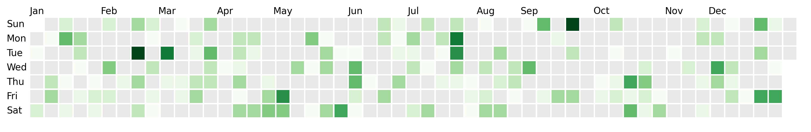

# dayplot

## Quick start

```py
import dayplot as dplot

df = dplot.load_sample()  # requires pandas to be installed

fig, ax = dplot.github_chart(
    dates=df["date"],
    values=df["values"],
    start_date="2024-01-01",
    end_date="2024-12-31"
)
```


