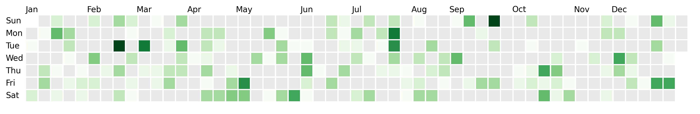

# dayplot


A simple-to-use Python library to build **calendar heatmaps** with ease. It's built on top of **matplotlib** and leverages it to access high customization possibilities.

## Examples

=== "Quick start"

    

    ```py
    import matplotlib.pyplot as plt
    import dayplot as dp

    df = dp.load_dataset("pandas") # can also be "polars", "pyarrow", etc

    fig, ax = plt.subplots(figsize=(15, 6))
    dp.calendar(
        dates=df["dates"],
        values=df["values"],
        start_date="2024-01-01",
        end_date="2024-12-31",
        ax=ax,
    )
    ```

=== "Colormap"

    

    ```py
    import matplotlib.pyplot as plt
    import dayplot as dp

    df = dp.load_dataset("pandas")

    fig, ax = plt.subplots(figsize=(15, 6))
    dp.calendar(
        dates=df["dates"],
        values=df["values"],
        cmap="Reds", # any matplotlib colormap
        start_date="2024-01-01",
        end_date="2024-12-31",
        ax=ax,
    )
    ```

=== "Fill the gap"

    

    ```py
    import matplotlib.pyplot as plt
    import dayplot as dp

    df = dp.load_dataset("pandas")

    fig, ax = plt.subplots(figsize=(16, 4))
    dp.calendar(
        dates=df["dates"],
        values=df["values"],
        start_date="2024-01-01",
        end_date="2024-12-31",
        mutation_scale=1.22,
        ax=ax,
    )
    ```

=== "Dark theme"

    

    ```py
    import matplotlib.pyplot as plt
    import dayplot as dp

    df = dp.load_dataset("pandas")

    fig, ax = plt.subplots(figsize=(15, 6))
    dp.calendar(
        dates=df["dates"],
        values=df["values"],
        start_date="2024-01-01",
        end_date="2024-12-31",
        color_for_none="#bcbcbc",
        edgecolor="white",
        edgewidth=0.4,
        cmap="OrRd",
        day_kws={"color": "white"},
        month_kws={"color": "white"},
        ax=ax,
    )
    fig.set_facecolor("#2a2929")
    ax.set_facecolor("#2a2929")
    ```

=== "Round boxes"

    

    ```py
    import matplotlib.pyplot as plt
    import dayplot as dp

    df = dp.load_dataset("pandas")

    fig, ax = plt.subplots(figsize=(16, 4))
    dp.calendar(
        dates=df["dates"],
        values=df["values"],
        start_date="2024-01-01",
        end_date="2024-12-31",
        boxstyle="circle",
        ax=ax,
    )
    ```

=== "Github style"

    

    ```py
    import matplotlib.pyplot as plt
    import dayplot as dp

    df = dp.load_dataset("pandas")

    fig, ax = plt.subplots(figsize=(16, 4))
    dp.calendar(
        dates=df["dates"],
        values=df["values"],
        start_date="2024-01-01",
        end_date="2024-12-31",
        ax=ax,
        **dp.styles["github"]
    )
    fig.set_facecolor("#0d1117")
    ax.set_facecolor("#0d1117")
    ```

<span style="font-size: 1rem; font-weight: bold;">[See more examples](./tuto/basic-styling.md)</span>

## Installation

=== "stable"

    ```bash
    pip install dayplot
    ```

=== "dev"

    ```bash
    pip install git+https://github.com/y-sunflower/dayplot.git@main
    ```

## Related projects

- [calplot](https://github.com/tomkwok/calplot){target=\_blank}
- [july](https://github.com/e-hulten/july){target=\_blank}
- [calendarplot](https://github.com/dhowland/calendarplot){target=\_blank}

<br><br>
