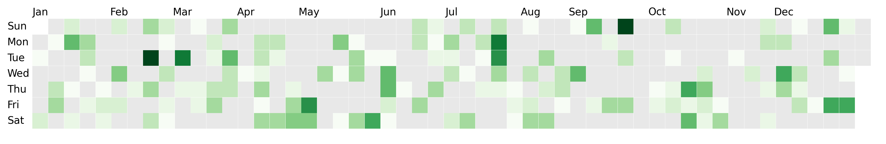

# dayplot

A simple-to-use Python library to build **calendar heatmaps** with ease. It's built on top of **matplotlib** and leverages it to access high customization possibilities.

## Examples

=== "Quick start"

    

    ```py
    import matplotlib.pyplot as plt

    import dayplot as dp
    from dayplot.data import load_dataset

    df = load_dataset()  # requires pandas to be installed

    fig, ax = plt.subplots(figsize=(15, 6))
    dp.calendar(
        dates=df["dates"],
        values=df["values"],
        start_date="2024-01-01",
        end_date="2024-12-31",
        ax=ax,
    )
    ```

=== "Colormap"

    

    ```py
    import matplotlib.pyplot as plt

    import dayplot as dp
    from dayplot.data import load_dataset

    df = load_dataset()

    fig, ax = plt.subplots(figsize=(15, 6))
    dp.calendar(
        dates=df["dates"],
        values=df["values"],
        cmap="Reds", # any matplotlib colormap
        start_date="2024-01-01",
        end_date="2024-12-31",
        ax=ax,
    )
    ```

=== "Negative values"

    

    ```py
    import matplotlib.pyplot as plt

    import dayplot as dp
    from dayplot.data import load_dataset

    df = load_dataset()

    # add negative values at some random dates
    df.loc[df.sample(n=40, replace=False).index, "values"] *= -1

    fig, ax = plt.subplots(figsize=(16, 4))
    dp.calendar(
        dates=df["dates"],
        values=df["values"],
        cmap="RdBu", # use a diverging colormap (red -> white -> blue)
        start_date="2024-01-01",
        end_date="2024-12-31",
        ax=ax,
    )
    ```

=== "Fill the gap"

    

    ```py
    import matplotlib.pyplot as plt

    import dayplot as dp
    from dayplot.data import load_dataset

    df = load_dataset()

    fig, ax = plt.subplots(figsize=(16, 4))
    dp.calendar(
        dates=df["dates"],
        values=df["values"],
        start_date="2024-01-01",
        end_date="2024-12-31",
        mutation_scale=1.15,
        ax=ax,
    )
    ```

=== "Dark theme"

    

    ```py
    import matplotlib.pyplot as plt

    import dayplot as dp
    from dayplot.data import load_dataset

    df = load_dataset()

    fig, ax = plt.subplots(figsize=(15, 6))
    dp.calendar(
        df["dates"],
        df["values"],
        start_date="2024-01-01",
        end_date="2024-12-31",
        color_for_none="#bcbcbc",
        edgecolor="white",
        edgewidth=0.4,
        cmap="OrRd",
        day_kws={"color": "white"},
        month_kws={"color": "white"},
        ax=ax,
    )
    fig.set_facecolor("#2a2929")
    ax.set_facecolor("#2a2929")
    ```

=== "Round boxes"

    

    ```py
    import matplotlib.pyplot as plt

    import dayplot as dp
    from dayplot.data import load_dataset

    df = load_dataset()

    fig, ax = plt.subplots(figsize=(16, 4))
    dp.calendar(
        dates=df["dates"],
        values=df["values"],
        start_date="2024-01-01",
        end_date="2024-12-31",
        boxstyle="circle",
        ax=ax,
    )
    ```

You can find more examples in the [Gallery](gallery).

## Installation

```bash
pip install dayplot
```

## Advanced usage

`dayplot` is designed to fit any matplotlib graph, allowing you to do things like:

[](tuto/advanced)

## Related projects

- [calplot](https://github.com/tomkwok/calplot){target=\_blank}
- [july](https://github.com/e-hulten/july){target=\_blank}
- [calendarplot](https://github.com/dhowland/calendarplot){target=\_blank}

<br><br>
