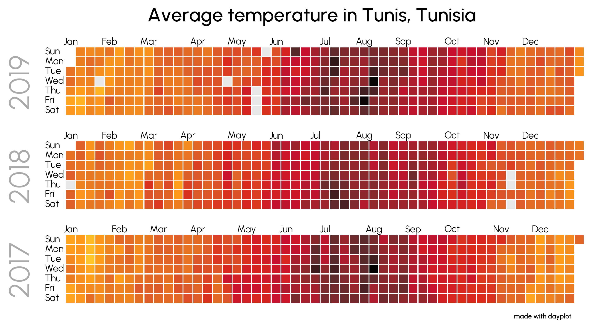

# Advanced examples

Here's a list of cool uses for `dayplot` to demonstrate its capabilities. It regularly uses external libraries such as [pyfonts](https://github.com/JosephBARBIERDARNAL/pyfonts){target=\_blank} or [pypalettes](https://github.com/JosephBARBIERDARNAL/pypalettes){target=\_blank}.

## Average temperature in Tunis

The dataset can be found [here](https://www.kaggle.com/datasets/sudalairajkumar/daily-temperature-of-major-cities){target=\_blank}.

```py
import pandas as pd
import matplotlib.pyplot as plt
from pypalettes import load_cmap
from pyfonts import load_font
import dayplot as dp


df = pd.read_csv("city_temperature.csv", low_memory=False)
df = df[df["City"] == "Tunis"]
df = df[df["Year"].isin([2017, 2018, 2019])]
df["Date"] = pd.to_datetime(df[["Year", "Month", "Day"]])
df = df[df["AvgTemperature"] != -99.0]

cmap = load_cmap("jazz_city", cmap_type="continuous", reverse=True)
font_url = "https://github.com/coreyhu/Urbanist/blob/main/fonts/ttf"
fontlight = load_font(f"{font_url}/Urbanist-Light.ttf?raw=true")
fontmedium = load_font(f"{font_url}/Urbanist-Medium.ttf?raw=true")

style_args = dict(
    cmap=cmap,
    day_kws={"font": fontlight},
    month_kws={"font": fontlight},
    day_x_margin=0.03,
    month_y_margin=0.5,
)

fig, axs = plt.subplots(nrows=3, figsize=(15, 5), layout="tight")
dp.calendar(
    df["Date"],
    df["AvgTemperature"],
    start_date="2019-01-01",
    end_date="2019-12-31",
    ax=axs[0],
    **style_args,
)
dp.calendar(
    df["Date"],
    df["AvgTemperature"],
    start_date="2018-01-01",
    end_date="2018-12-31",
    ax=axs[1],
    **style_args,
)
dp.calendar(
    df["Date"],
    df["AvgTemperature"],
    start_date="2017-01-01",
    end_date="2017-12-31",
    ax=axs[2],
    **style_args,
)
fig.text(
    x=0.5,
    y=0.94,
    s="Average temperature in Tunis, Tunisia",
    size=20,
    ha="center",
    font=fontmedium,
)
fig.text(
    x=0.75,
    y=0.08,
    s="made with dayplot",
    size=7,
    ha="right",
    font=fontmedium,
)
text_args = dict(
    x=-6, y=3.5, size=30, rotation=90, color="#aaa", va="center", font=fontlight
)
axs[0].text(s="2019", **text_args)
axs[1].text(s="2018", **text_args)
axs[2].text(s="2017", **text_args)
```



<br><br>
