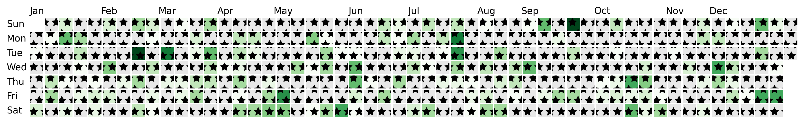

## Make fancy cells

Under the hood, `dayplot` uses a niche matplotlib object called a [`FancyBboxPatch`](https://matplotlib.org/stable/api/_as_gen/matplotlib.patches.FancyBboxPatch.html){target=\_blank}. It's pretty much a rectangle, but with much higher customization level.

### boxstyle

By default, you'll get simple squares, but you can leverage the `boxstyle` argument to do much fancier things.

- circle

```py
import matplotlib.pyplot as plt
import dayplot as dp

df = load_dataset()

fig, ax = plt.subplots(figsize=(16, 4))
dp.calendar(
    dates=df["dates"],
    values=df["values"],
    start_date="2024-01-01",
    end_date="2024-12-31",
    boxstyle="circle",
    ax=ax,
)
```


- round

```py
import matplotlib.pyplot as plt
import dayplot as dp

df = load_dataset()

fig, ax = plt.subplots(figsize=(16, 4))
dp.calendar(
    dates=df["dates"],
    values=df["values"],
    start_date="2024-01-01",
    end_date="2024-12-31",
    boxstyle="round",
    ax=ax,
)
```


- sawtooth

```py
import matplotlib.pyplot as plt
import dayplot as dp

df = load_dataset()

fig, ax = plt.subplots(figsize=(16, 4))
dp.calendar(
    dates=df["dates"],
    values=df["values"],
    start_date="2024-01-01",
    end_date="2024-12-31",
    boxstyle="sawtooth",
    ax=ax,
)
```


- roundtooth

```py
import matplotlib.pyplot as plt
import dayplot as dp

df = load_dataset()

fig, ax = plt.subplots(figsize=(16, 4))
dp.calendar(
    dates=df["dates"],
    values=df["values"],
    start_date="2024-01-01",
    end_date="2024-12-31",
    boxstyle="roundtooth",
    ax=ax,
)
```


<br>

### Other arguments

The `dp.calendar()` function will take all additional arguments and pass them to each [`FancyBboxPatch`](https://matplotlib.org/stable/api/_as_gen/matplotlib.patches.FancyBboxPatch.html){target=\_blank}.

This means that any argument that this class accepts will be accepted. Here is a non-exhaustive list.

- mutation_scale (size scale)

```py
import matplotlib.pyplot as plt
import dayplot as dp

df = load_dataset()

fig, ax = plt.subplots(figsize=(16, 4))
dp.calendar(
    dates=df["dates"],
    values=df["values"],
    start_date="2024-01-01",
    end_date="2024-12-31",
    mutation_scale=1.15,
    ax=ax,
)
```


- hatch

```py
import matplotlib.pyplot as plt
import dayplot as dp

df = load_dataset()

fig, ax = plt.subplots(figsize=(16, 4))
dp.calendar(
    dates=df["dates"],
    values=df["values"],
    start_date="2024-01-01",
    end_date="2024-12-31",
    hatch="*",
    ax=ax,
)
```



- alpha

```py
import matplotlib.pyplot as plt
import dayplot as dp

df = load_dataset()

fig, ax = plt.subplots(figsize=(16, 4))
dp.calendar(
    dates=df["dates"],
    values=df["values"],
    start_date="2024-01-01",
    end_date="2024-12-31",
    alpha=0.5,
    ax=ax,
)
```


- linestyle

```py
import matplotlib.pyplot as plt
import dayplot as dp

df = load_dataset()

fig, ax = plt.subplots(figsize=(16, 4))
dp.calendar(
    dates=df["dates"],
    values=df["values"],
    start_date="2024-01-01",
    end_date="2024-12-31",
    linestyle="--",
    edgewidth=1,
    ax=ax,
)
```


<br><br>
