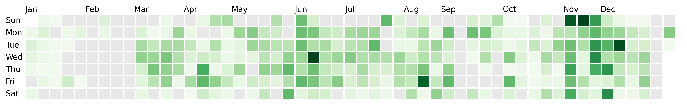

# Fetch and plot github contributions

`dayplot` also provides a `dp.fetch_github_contrib()` function, to automatically get contribution data from a given user.

To use this function, you need a valid Github token with the `read:user` admin right. You can create such a token [here](https://github.com/settings/tokens){target=\_blank}.

Since we don't want to share this token with other people, here I load my Github token using the `dotenv` package. It's advised to do so, but not mandatory for the code to work.

### Fetch the data

The `dp.fetch_github_contrib()` function requires you to pass:

- a Github username
- your Github token
- start and end dates to fetch the data using ISO 8601 format (e.g. `"2024-01-01T00:00:00Z"`)

```py
import matplotlib.pyplot as plt
from dotenv import load_dotenv
import os

import dayplot as dp

load_dotenv()
token = os.getenv("GITHUB_TOKEN")

# requires both pandas and requests to be installed
my_data = dp.fetch_github_contrib(
    username="JosephBARBIERDARNAL", # this is my Github username
    github_token=token,
    start_date="2024-01-01T00:00:00Z",
    end_date="2024-12-31T23:59:59Z",
)
```

Here, `my_data` is a pandas dataframe with 2 columns: `"dates"` and `"values"`.

### Plot the data

Once I've fetched this data, I can plot my contribution chart:

```py
fig, ax = plt.subplots(figsize=(15, 6))
dp.calendar(
    dates=my_data["dates"],
    values=my_data["values"],
    start_date="2024-01-01",
    end_date="2024-12-31",
    ax=ax,
)
```


