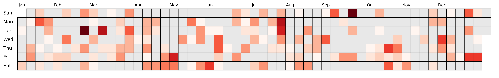
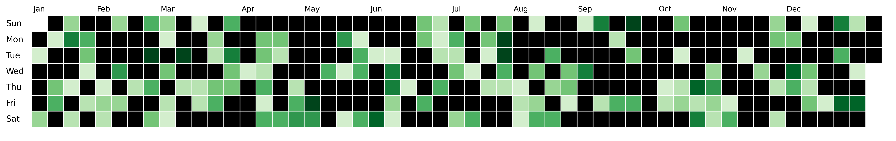

### Handling negative values

Pro tips: you can find great colormaps using [pypalettes](https://python-graph-gallery.com/color-palette-finder/){target=\_blank}.

```py
import matplotlib.pyplot as plt
import dayplot as dp

df = dp.load_dataset()

fig, ax = plt.subplots(figsize=(15, 6))
dp.calendar(
    dates=df["dates"],
    values=df["values"],
    cmap="RdBu", # use a diverging colormap
    start_date="2023-01-01",
    end_date="2023-12-31",
    ax=ax,
)
```



<br>

### Change other colors

You can change the color between squares with the `edgecolor` argument and the color for "none" (aka 0) with the `color_for_none` argument.

Also, use `edgewidth` to moderate the width of the edge between squares.

```py
import matplotlib.pyplot as plt
import dayplot as dp

df = dp.load_dataset()

fig, ax = plt.subplots(figsize=(15, 6))
dp.calendar(
    dates=df["dates"],
    values=df["values"],
    start_date="2024-01-01",
    end_date="2024-12-31",
    edgecolor="white",      # any matplotlib color
    color_for_none="black", # any matplotlib color
    edgewidth=1,
    ax=ax,
)
```



<br><br>
